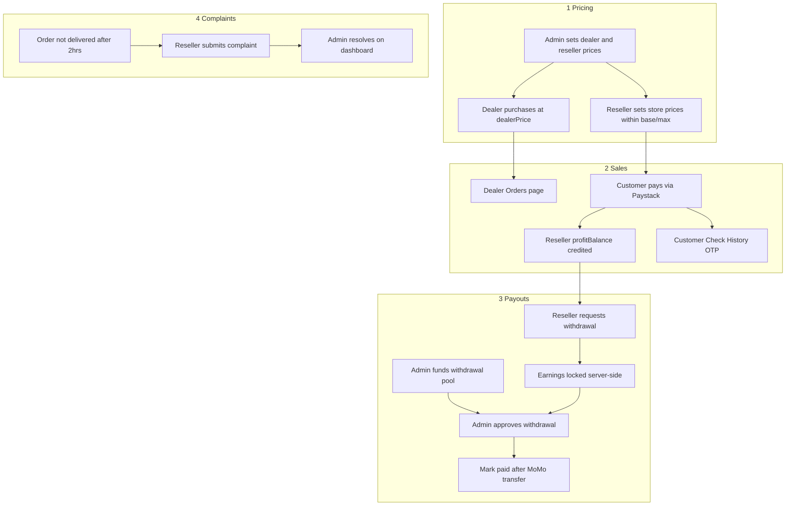

# Data Bundle Reseller SaaS Platform

A production-ready, mobile-first Data Bundle Reseller SaaS platform for Ghana. Supports Admin, Dealer, Reseller, and Customer roles with white-label stores, Paystack payments, dealer API, complaints, and secure withdrawals.

## Tech Stack

| Layer | Technology |
|-------|-----------|
| Frontend | React 19, Vite, TypeScript, Tailwind CSS |
| Backend | Node.js, Express.js, TypeScript |
| Database | MongoDB (Mongoose) |
| Auth | JWT + Email OTP |
| Payments | Paystack |
| Email | Nodemailer |

## Quick Start

```bash
npm install
cd backend && npm install
cd ../frontend && npm install

cp backend/.env.example backend/.env
cp frontend/.env.local.example frontend/.env.local

npm run dev
```

- Frontend: http://localhost:3000
- Backend API: http://localhost:5055 (proxied via `/api` in dev)

### Default logins (auto-seeded)

| Role | URL | Demo credentials |
|------|-----|------------------|
| Admin | `/login/admin` | From `ADMIN_EMAIL` / `ADMIN_PASSWORD` in `.env` |
| Dealer | `/login/dealer` | `dealer@databundle.test` / `Dealer@12345` |
| Reseller | `/login/reseller` | `reseller@databundle.test` / `Reseller@12345` |

## Platform flows (connected end-to-end)



### Flow summary

1. **Admin** edits package prices → affects all **dealers** (dealer price) and **resellers** (base/max) immediately.
2. **Dealer** funds wallet (Paystack) → buys data (dashboard, bulk, or API) → orders appear on **Dealer Orders**.
3. **Customer** buys on reseller store → Paystack callback → order created → profit credited → customer redirected to **Check History**.
4. **Reseller** requests withdrawal → funds reserved → **Admin** adds money to pool in **Settings** → approves in **Withdrawals**.
5. **Reseller** files complaint (2hr+ undelivered, 24hr window) → **Admin** resolves in **Complaints**.

## Environment flags

| Variable | Purpose |
|----------|---------|
| `DEV_SKIP_OTP=true` | Skip email OTP in development |
| `DEV_AUTO_DELIVER=false` | Disable 5s auto-deliver simulation (set `true` to simulate instant delivery) |

## User roles

| Role | Portal paths |
|------|----------------|
| **Admin** | `/admin`, `/admin/packages`, `/admin/resellers`, `/admin/withdrawals`, `/admin/complaints`, `/admin/settings` |
| **Dealer** | `/dealer`, `/dealer/wallet`, `/dealer/purchase`, `/dealer/bulk`, `/dealer/orders`, `/dealer/api` |
| **Reseller** | `/reseller`, `/reseller/store`, `/reseller/prices`, `/reseller/orders`, `/reseller/withdrawals`, `/reseller/complaints` |
| **Customer** | `/store/{slug}` (public store + Check History) |

## Dealer API

Base URL: `http://localhost:3000/api/v1/dealer` (or your production API URL)

Headers: `x-api-key`, `x-secret-key`

Documented in the dealer portal at `/dealer/api`. Webhook URL (optional) receives POST when API orders are marked delivered or failed.

## Key API routes

- Auth: `/api/auth/*`
- Admin: `/api/admin/*`
- Dealer portal: `/api/dealer/*`
- Dealer API v1: `/api/v1/dealer/*`
- Reseller: `/api/reseller/*`
- Store (public): `/api/store/:slug/*`
- Paystack: `/api/webhooks/paystack`, `/api/webhooks/verify/:reference`

## Production deployment

1. Set `NODE_ENV=production`
2. Use strong `JWT_SECRET`
3. Configure MongoDB Atlas
4. Configure Paystack live keys
5. Set `DEV_AUTO_DELIVER=false` (use real telco delivery integration)
6. Build: `npm run build`

## License

Private — All rights reserved.
